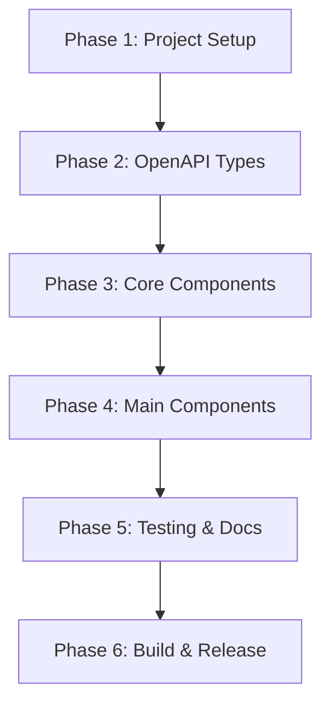

# Nutrient DWS TypeScript Client - Build Plan

## Overview
This document outlines a phased approach to building the Nutrient DWS TypeScript Client library according to the technical specification. The plan follows a two-stage implementation strategy: auto-generated core components from OpenAPI spec + hand-crafted ergonomic wrapper.

## Phase 1: Project Foundation & Configuration
**Goal**: Establish a robust project structure with all necessary tooling

### Tasks:
1. **Initialize Project**
   - Create package.json with proper metadata
   - Set up TypeScript configuration (tsconfig.json)
   - Configure dual build outputs (CommonJS + ESM)
   - Set up source maps for debugging

2. **Development Tooling**
   - Configure ESLint with TypeScript rules
   - Set up Prettier for code formatting
   - Add Husky for pre-commit hooks
   - Configure Jest for testing

3. **Project Structure**
   ```
   nutrient-dws-typescript-client/
   ├── src/
   │   ├── types/         # Type definitions
   │   ├── errors.ts      # Error classes
   │   ├── inputs.ts      # Input handling
   │   ├── http.ts        # HTTP layer
   │   ├── workflow.ts    # WorkflowBuilder
   │   ├── client.ts      # Main client
   │   └── index.ts       # Public exports
   ├── tests/
   ├── examples/
   ├── dist/              # Build output
   └── generated/         # OpenAPI generated types
   ```

4. **Dependencies**
   - axios (HTTP client)
   - form-data (Node.js FormData polyfill)
   - openapi-typescript (dev dependency)

## Phase 2: OpenAPI Integration & Type System
**Goal**: Generate and enhance TypeScript types from OpenAPI specification

### Tasks:
1. **OpenAPI Setup**
   - Obtain Nutrient DWS OpenAPI specification
   - Configure openapi-typescript generator
   - Create generation script in package.json

2. **Type Generation**
   - Generate base types from OpenAPI
   - Create type transformation utilities
   - Implement camelCase/snake_case converters

3. **Manual Type Extensions**
   - Create NutrientClientOptions interface
   - Define input type unions
   - Add workflow-specific types

## Phase 3: Core Foundation Components
**Goal**: Build the essential utilities and infrastructure

### Tasks:
1. **Error System (src/errors.ts)**
   - NutrientError base class
   - Specific error types (ValidationError, APIError, etc.)
   - Error response parsing

2. **Input Handler (src/inputs.ts)**
   - File path handling (Node.js)
   - Buffer/Uint8Array support
   - Blob/File support (browser)
   - URL string support
   - Proper type guards

3. **HTTP Layer (src/http.ts)**
   - Implement sendRequest function
   - Handle authentication (string | async function)
   - Case transformation (camelCase ↔ snake_case)
   - FormData construction
   - Error response handling

4. **Utilities**
   - Case transformation helpers
   - Environment detection (Node/browser)
   - Type guards and validators

## Phase 4: Main Components Implementation
**Goal**: Build the user-facing API components

### Tasks:
1. **NutrientClient (src/client.ts)**
   - Constructor with options validation
   - Authentication handling
   - Direct API method implementations
   - buildWorkflow() method

2. **WorkflowBuilder (src/workflow.ts)**
   - Fluent API design
   - Step management
   - Input/output handling
   - execute() implementation
   - Proper method chaining

3. **Integration**
   - Connect all components
   - Ensure proper typing flow
   - Add JSDoc documentation

## Phase 5: Testing & Documentation
**Goal**: Ensure reliability and usability

### Tasks:
1. **Unit Tests**
   - Error handling tests
   - Input handler tests
   - HTTP layer tests (mocked)
   - Case transformation tests

2. **Integration Tests**
   - Client initialization
   - Workflow execution
   - Error scenarios
   - Both Node.js and browser environments

3. **Documentation**
   - Comprehensive README
   - API reference generation
   - Security best practices guide
   - Migration guide (if applicable)

4. **Examples**
   - Basic usage examples
   - Node.js server example
   - Browser usage with token provider
   - Complex workflow examples

## Phase 6: Build & Release Preparation
**Goal**: Prepare for production use and npm publishing

### Tasks:
1. **Build Configuration**
   - Optimize bundle sizes
   - Generate type declarations
   - Create source maps
   - Set up tree-shaking

2. **Package Configuration**
   - Configure package.json exports
   - Set up npm scripts
   - Add repository information
   - Define peerDependencies

3. **Quality Assurance**
   - Run full test suite
   - Check bundle size
   - Validate type exports
   - Test in real projects

4. **Release Preparation**
   - Create CHANGELOG.md
   - Add LICENSE file
   - Set up GitHub Actions CI/CD
   - Prepare npm publish workflow

## Implementation Order & Dependencies



## Key Considerations

1. **Security First**: Ensure API key handling follows best practices for both environments
2. **Type Safety**: Maintain strong typing throughout, leveraging TypeScript's full capabilities
3. **Developer Experience**: Focus on intuitive APIs and clear error messages
4. **Performance**: Optimize for both bundle size and runtime performance
5. **Compatibility**: Test across Node.js versions and modern browsers

## Success Metrics

- ✅ 100% TypeScript coverage with strict mode
- ✅ Comprehensive test coverage (>90%)
- ✅ Bundle size <50KB minified
- ✅ Works in Node.js 14+ and modern browsers
- ✅ Clear, actionable error messages
- ✅ Intuitive API that "just works"

## Next Steps

Begin with Phase 1, establishing the project foundation. Each phase builds upon the previous, ensuring a solid, maintainable codebase that adheres to the technical specification.