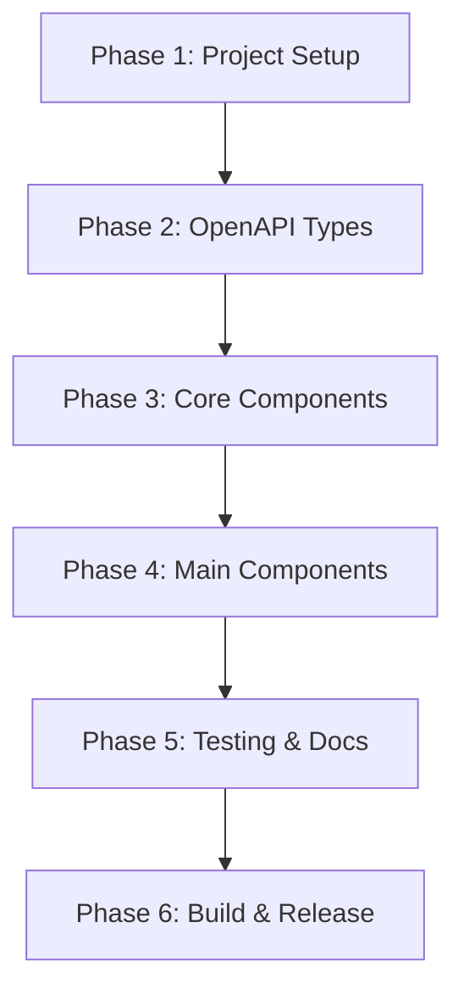

# Overview

This document outlines a phased approach to building the Nutrient DWS TypeScript Client library according to the technical specification. The plan follows a two-stage implementation strategy: auto-generated core components from OpenAPI spec + hand-crafted ergonomic wrapper.

## Implementation Strategy

The library is designed with a dual-layer architecture:

1. **Auto-generated Foundation**: Core types and API interfaces generated from the OpenAPI specification
2. **Hand-crafted Wrapper**: Ergonomic, developer-friendly API layer that provides:
   - Simplified method signatures
   - Intelligent input handling
   - Fluent workflow building
   - Strong TypeScript integration

## Implementation Order & Dependencies



Each phase builds upon the previous, ensuring a solid, maintainable codebase that adheres to the technical specification.

## Project Structure

```
nutrient-dws-typescript-client/
├── src/
│   ├── types/         # Type definitions
│   ├── errors.ts      # Error classes
│   ├── inputs.ts      # Input handling
│   ├── http.ts        # HTTP layer
│   ├── workflow.ts    # WorkflowBuilder
│   ├── client.ts      # Main client
│   └── index.ts       # Public exports
├── tests/
├── examples/
├── dist/              # Build output
└── generated/         # OpenAPI generated types
```